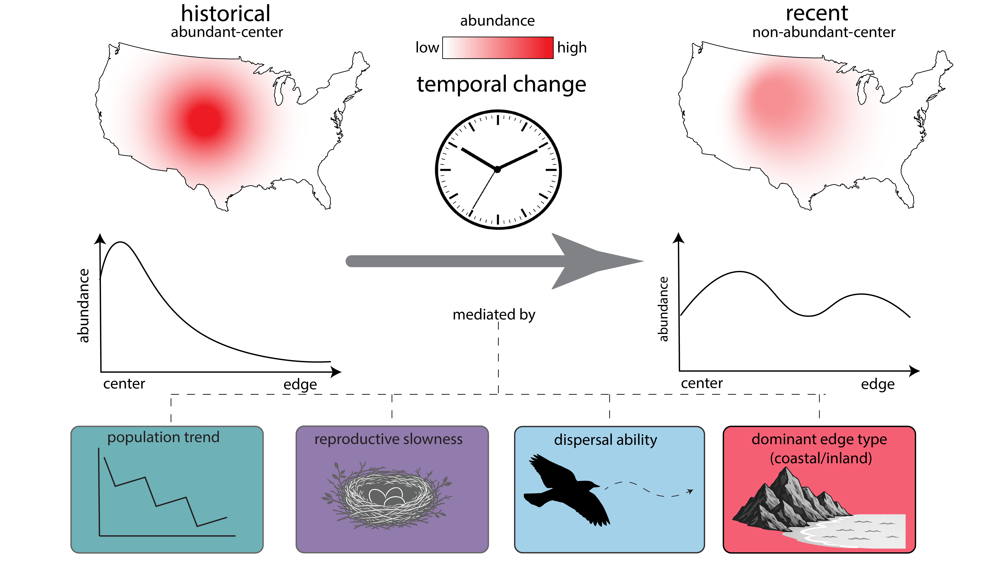

## BBS_Abundance
Abundance Distribution pattern changes over time

### Data/code DOI:
__________________________________________________________________________________________________________________________________________

## Abstract
The abundant-center hypothesis is a foundational idea in ecology, but previous work has largely assumed static patterns. Our objective was to quantify temporal variation in within-range abundance patterns and link those dynamics to traits related to demographic parameters and dispersal. To do so, we used the North American Breeding Bird Survey data for 203 species in historical (1980–1990) and recent (2013–2023) decades. We found that 18% of species showed changes in their within-range abundance pattern between the periods; 21% showed an abundant-center pattern in 1980–1990 while 27% showed an abundant-center pattern in 2013–2023. Species with large population changes, fast life histories, high dispersal ability, and predominantly noncoastal range edges were disproportionately likely to show changes in their within-range abundance patterns. These findings showed that abundant-center patterns are not fixed and highlight the importance of incorporating temporal dynamics into macroecological studies and conservation planning. 

 $~~~~~~~~~~~~~~~~~~~~~~~~~~~~~~~~~~~~~~~~~~~~~~~~~~~~~~~~~~~$ 
## Repository Directory

### code 
  * [01_data_filtering.R](./code/01_data_filtering.R). This script download Breeding bird survey data and eBird data, standardize species taxonomy, estimate range coverage and get the abundance data set for 1980–1990 and 2013–2023.
  * [02_data_filtering.R](./code/02_data_filtering.R). Quick script to filter species to remove waterbirds, kingfishers, owls, nightjars and dipper and filter species based on the range proportion
  * [03_pattern_classification.R](./code/03_pattern_classification.R). Script to classify within-range abundance pattern for each species and create the major edge type variable
  * [04_specieslist_add.R](./code/04_specieslist_add.R). Quick script to input the species list with proper scientific names to extract functional trait through different databases
  * [05_functional_traits.R](./code/05_functional_traits.R). Extraction of functional traits using different databases
  * [06_trait_imputation.R](./code/06_trait_imputation.R). Imputation of functional traits extracted through different databases.
  * [07_phylogenetic_pca.R](./code/07_phylogenetic_pca.R). Conducting phylogenetic principal component analysis and adding the population trend data set into the main data set.
  * [08_structuring.R](./code/08_structuring.R). Re-structuring the data set and adding additional functional traits to the data
  * [09_ACE_REDG_partitioning.R](./code/09_ACE_REDG_partitioning.R). Re-defining the abundant-center and rare-edge patterns, carrying out summary statistics on within-range abundance pattern, creating bar graph for change status
  * [10_REDG_GLM.R](./code/10_REDG_GLM.R). Fitting GLMs to see the association between the functional traits and the rare-edge pattern change through years
  * [11_ACE_GLM.R](./code/11_ACE_GLM.R). Fitting GLMs to see the association between the functional traits and the abundant-center pattern change through years
  * [12_REDG_GLM_figs.R](./code/12_REDG_GLM_figs.R). Creating the predictive probability plots for the rare-edge pattern changes association with the functional traits
  * [13_ACE_GLM_figs.R](./code/13_ACE_GLM_figs.R). Creating the predictive probability plots for the abundant-center pattern changes association with the functional traits
  * [14_conditional_inference_tree.R](./code/14_conditional_inference_tree.R). Script for the conditional inference tree analysis done to see the specific pattern change association with the selected functional traits for both abundant-center and rare-edge patterns
  * [15_abundance_histograms.R](./code/15_abundance_histograms.R). Script to create within-range abundance pattern histograms for each species in historical and recent data

### data

  * [all_birds_merged.xlsx](./Data/all_birds_merged.xlsx). Table representing the species status whether it is a core species or not according to the [Sauer et al. 2017](https://bioone.org/journals/the-condor/volume-119/issue-3/CONDOR-17-83.1/The-first-50-years-of-the-North-American-Breeding-Bird/10.1650/CONDOR-17-83.1.full).
    | column | meaning |
    |--------|---------|
    | Common name | Common name of the species per [Sauer et al. 2017](https://bioone.org/journals/the-condor/volume-119/issue-3/CONDOR-17-83.1/The-first-50-years-of-the-North-American-Breeding-Bird/10.1650/CONDOR-17-83.1.full) |
    | Scientific name | scientific name of the species per [Sauer et al. 2017](https://bioone.org/journals/the-condor/volume-119/issue-3/CONDOR-17-83.1/The-first-50-years-of-the-North-American-Breeding-Bird/10.1650/CONDOR-17-83.1.full) |
    | Core | Categorical with two level (core, non-core); Whether the species is core species or not according the [Sauer et al. 2017](https://bioone.org/journals/the-condor/volume-119/issue-3/CONDOR-17-83.1/The-first-50-years-of-the-North-American-Breeding-Bird/10.1650/CONDOR-17-83.1.full)  |

   * [SpeciesList.csv](./Data/SpeciesList.csv) Table for list of taxa for which there are data in the 1966-2022 Breeding Bird Survey data release
      | column | meaning |
      |--------|---------|
      | Seq | Phylogenetic sequence number per Breeding Bird Survey data|
      | AOU | The unique taxa ID number. This is unique identifier is used for BBS data management and throughout the data release files in place of species name |
      | English_Common_Name | Common English name of the taxa per Breeding bird survey data |
      | French_Common_Name | Common French name of the taxa per Breeding bird survey data |
      | Order | Order of which the species belongs to |
      | Family | Family of which the species belongs to |
      | Genus | Genus of which the species belongs to |
      | Species | Species epithet of the scientific name |
   * [Trends_df.csv](./Data/Trends_df.csv) Table representing the percentage change of population size between 1993–2015 according to the [Sauer et al. 2017](https://bioone.org/journals/the-condor/volume-119/issue-3/CONDOR-17-83.1/The-first-50-years-of-the-North-American-Breeding-Bird/10.1650/CONDOR-17-83.1.full)
      | column | meaning |
      |--------|---------|
      | aou |  The unique taxa ID number. This is unique identifier is used for BBS data management and throughout the data release files in place of species name |
      | Trend | Percentage change of population per year from 1993–2015 |

   * [Bird_base_2.xlsx](./Data/Bird_base_2.xlsx) We use this data set to get the synonyms of the species to use in joining different functional data sets together. This data set was downloaded from [Şekercioğlu et al. 2025](https://www.nature.com/articles/s41597-025-05615-3) and see that for the column identifiers. We didn't include the column identifiers because it has many columns and is easily can be found in the paper. 
  
   *** NOTE ** AllBirdsHackett1.tre is not included in this repository due to file size limitations. We retrieved this phylogenetic tree data from the [BirdTree.org](https://birdtree.org/) -> Downloads -> Full trees (9993 species), Hackett backbone ->      HackettStage2_0001_1000. A zip file was downloaded. Then clicked through each file until it reached the combinedTrees and the AllBirdsHackett1.tre can be found within that.

### Figures

  * [Figure_1.png](./Figures/Figure_1.png) Figure 1
  * [Figure_1.ai](./Figures/Figure_1.ai) Figure 1 (Adobe illustrator format)
  * [Figure_2.png](./Figures/Figure_2.png) Figure 2
  * [Figure_2.ai](./Figures/Figure_2.ai) Figure 2 (Adobe illustrator format)
  * [Figure_3.png](./Figures/Figure_3.png) Figure 3
  * [Figure_3.ai](./Figures/Figure_3.ai) Figure 3 (Adobe illustrator format)
  * [Figure_4.png](./Figures/Figure_4.png) Figure 4
  * [Figure_4.ai](./Figures/Figure_4.ai) Figure 4 (Adobe illustrator format)

### Results

***** Note *** The following description contains the input data and the output data/results saved on the R workspace from the Rcripts. The above RScripts in the code section were labelled with a number and the code should be run in that order. Also if you want to produce a certain Rscript, make sure to run the precedent script which produce the input data sets for the relevant Rscript.

---

* [01_data_filtering.R](./code/01_data_filtering.R)

- **Input data**
  - `all_birds_merged.xlsx`
  | column | meaning |
    |--------|---------|
    | Common name | Common name of the species per [Sauer et al. 2017](https://bioone.org/journals/the-condor/volume-119/issue-3/CONDOR-17-83.1/The-first-50-years-of-the-North-American-Breeding-Bird/10.1650/CONDOR-17-83.1.full) |
    | Scientific name | scientific name of the species per [Sauer et al. 2017](https://bioone.org/journals/the-condor/volume-119/issue-3/CONDOR-17-83.1/The-first-50-years-of-the-North-American-Breeding-Bird/10.1650/CONDOR-17-83.1.full) |
    | Core | Categorical with two level (core, non-core); Whether the species is core species or not according the [Sauer et al. 2017](https://bioone.org/journals/the-condor/volume-119/issue-3/CONDOR-17-83.1/The-first-50-years-of-the-North-American-Breeding-Bird/10.1650/CONDOR-17-83.1.full)  

- **Output data**
  - `abundance_first_dec.csv` - Breeding bird survey abundance data set for 1980–1990
  | column | meaning |
     |--------|---------|
     | route_data_id | Unique id for the species in a particular route in a particular year |
     | country_num | Three-digit identification code for country |
     | state_num | Two-digit numerical code that identifies the state, province or territory where the route is located |
     | route | Three-digit code that identifies the route; unique within states |
     | rpid | Three-digit run protocol ID (RPID) number |
     | latitude | Latitude of the route start point (in decimal degrees, NAD 83) |
     | longitude | Longitude of the route start point (in decimal degrees, NAD 83) |
     | year | Four-digit year of the survey |
     | aou | Five-digit species identification number |
     | count_10 | Total individuals of the species recorded on stops 1-10 |
     | count_20 | Total individuals of the species recorded on stops 11-20 |
     | count_30 | Total individuals of the species recorded on stops 21-30 |
     | count_40 | Total individuals of the species recorded on stops 31-40 |
     | count_50 | Total individuals of the species recorded on stops 41-50 |
     | stop_total | Total number of stops (out of 50) on which the species was recorded |
     | species_total | Total individuals of the species recorded on that run of the route (sum of stops) |
     | bcr | Bird Conservation Region where the route is located |
     | obs_n | Observer Number of the person who conducted the run |
     | run_type | The run_type code identifies which data were collected consistent with all standard BBS criteria. |
   

  - `abundance_last_dec.csv` - Breeding bird survey abundance data set for 2013–2023
  
  | column | meaning |
   |--------|---------|
   | route_data_id | Unique id for the species in a particular route in a particular year |
   | country_num | Three-digit identification code for country |
   | state_num | Two-digit numerical code that identifies the state, province or territory where the route is located |
   | route | Three-digit code that identifies the route; unique within states |
   | rpid | Three-digit run protocol ID (RPID) number |
   | latitude | Latitude of the route start point (in decimal degrees, NAD 83) |
   | longitude | Longitude of the route start point (in decimal degrees, NAD 83) |
   | year | Four-digit year of the survey |
   | aou | Five-digit species identification number |
   | count_10 | Total individuals of the species recorded on stops 1-10 |
   | count_20 | Total individuals of the species recorded on stops 11-20 |
   | count_30 | Total individuals of the species recorded on stops 21-30 |
   | count_40 | Total individuals of the species recorded on stops 31-40 |
   | count_50 | Total individuals of the species recorded on stops 41-50 |
   | stop_total | Total number of stops (out of 50) on which the species was recorded |
   | species_total | Total individuals of the species recorded on that run of the route (sum of stops) |
   | bcr | Bird Conservation Region where the route is located |
   | obs_n | Observer Number of the person who conducted the run |
   | run_type | The run_type code identifies which data were collected consistent with all standard BBS criteria. |
   

  - `prop_species_all_final.csv` - Data set representing the proportion of range covered by the Breeding Bird Survey data from its true range
  
  | column | meaning |
   |--------|---------|
   | Common name | Common name of the species |
   | Scientific name | scientific name of the species |
   | Core | Whether the species is core species or not according the [Sauer et al. 2017](https://bioone.org/journals/the-condor/volume-119/issue-3/CONDOR-17-83.1/The-first-50-years-of-the-North-American-Breeding-Bird/10.1650/CONDOR-17-83.1.full) |
   | percentage | percentage coverage of the species range by the Breeding bird survey data of its true range |

  - `bbs_routes_select.csv` - Selected routes from both historic and recent decades

| column | meaning |
   |--------|---------|
   | country_num | Three-digit identification code for country |
   | state_num | Two-digit numerical code that identifies the state, province or territory where the route is located |
   | route | Three-digit code that identifies the route; unique within states |
   | route_name | Name of the route |
   | active | Indicates if the route is currently active, or has been discontinued. A route can be active and not sampled in a given year |
   | latitude | Latitude of the route start point (in decimal degrees, NAD 83) |
   | longitude | Longitude of the route start point (in decimal degrees, NAD 83) |
   | bcr | Bird Conservation Region where the route is located |
   | route_type_id | Indicates if a route was established along a roadside, or on a body of water |
   | route_type_detail_id | Indicates route length and selection criteria |
   | route_data_id | Data identification number; unique for each combination of CountryNum, StateNum, Route, RPID, and Year |
   | rpid | Three-digit run protocol ID (RPID) number |
   | year | Four-digit year of the survey |
   | month | Month surveyed |
   | day | Day surveyed |
   | obs_n | Observer Number of the person who conducted the run |
   | total_spp | Total number of taxa recorded during the run (including species, easily identifiable subspecific forms, hybrids, and superspecies complexes for which species-level identification is not always possible) |
   | start_temp | Temperature at the start of the run. |
   | end_temp | Temperature at the end of the run |
   | temp_scale | Temperate Scale |
   | start_wind | Wind speed status at the start of the run, using Beaufort Scale wind speed indicators |
   | end_wind | Wind speed status at the end of the run, using Beaufort Scale wind speed indicators |
   | start_sky | Sky conditions at the start of the run, using National Weather Service Codes |
   | end_sky | Sky conditions at the end of the run, using National Weather Service Codes |
   | start_time | Time the run was started (recorded in 24-hour local time). |
   | end_time | Time the run was ended (recorded in 24-hour local time) |
   | assistant | Indicates if an assistant was used to record the data collected by the observer. |
   | quality_current_id | Indicates whether the route sampling event (i.e., the run) took place under suitable weather conditions and met suitable time, date, and route completion criteria |
   | run_type | The run_type code identifies which data were collected consistent with all standard BBS criteria. |
   | state | States |
   | st_abrev | Abbreviation for the states |
   | country | Country code of the route |

---

* [02_data_filtering.R](./code/02_data_filtering.R)

- **Input data**
   - `abundance_first_dec.csv` - Breeding bird survey abundance data set for 1980–1990
  
  | column | meaning |
   |--------|---------|
   | route_data_id | Unique id for the species in a particular route in a particular year |
   | country_num | Three-digit identification code for country |
   | state_num | Two-digit numerical code that identifies the state, province or territory where the route is located |
   | route | Three-digit code that identifies the route; unique within states |
   | rpid | Three-digit run protocol ID (RPID) number |
   | latitude | Latitude of the route start point (in decimal degrees, NAD 83) |
   | longitude | Longitude of the route start point (in decimal degrees, NAD 83) |
   | year | Four-digit year of the survey |
   | aou | Five-digit species identification number |
   | count_10 | Total individuals of the species recorded on stops 1-10 |
   | count_20 | Total individuals of the species recorded on stops 11-20 |
   | count_30 | Total individuals of the species recorded on stops 21-30 |
   | count_40 | Total individuals of the species recorded on stops 31-40 |
   | count_50 | Total individuals of the species recorded on stops 41-50 |
   | stop_total | Total number of stops (out of 50) on which the species was recorded |
   | species_total | Total individuals of the species recorded on that run of the route (sum of stops) |
   | bcr | Bird Conservation Region where the route is located |
   | obs_n | Observer Number of the person who conducted the run |
   | run_type | The run_type code identifies which data were collected consistent with all standard BBS criteria. |

  - `abundance_last_dec.csv` - Breeding bird survey abundance data set for 2013–2023

  | column | meaning |
   |--------|---------|
   | route_data_id | Unique id for the species in a particular route in a particular year |
   | country_num | Three-digit identification code for country |
   | state_num | Two-digit numerical code that identifies the state, province or territory where the route is located |
   | route | Three-digit code that identifies the route; unique within states |
   | rpid | Three-digit run protocol ID (RPID) number |
   | latitude | Latitude of the route start point (in decimal degrees, NAD 83) |
   | longitude | Longitude of the route start point (in decimal degrees, NAD 83) |
   | year | Four-digit year of the survey |
   | aou | Five-digit species identification number |
   | count_10 | Total individuals of the species recorded on stops 1-10 |
   | count_20 | Total individuals of the species recorded on stops 11-20 |
   | count_30 | Total individuals of the species recorded on stops 21-30 |
   | count_40 | Total individuals of the species recorded on stops 31-40 |
   | count_50 | Total individuals of the species recorded on stops 41-50 |
   | stop_total | Total number of stops (out of 50) on which the species was recorded |
   | species_total | Total individuals of the species recorded on that run of the route (sum of stops) |
   | bcr | Bird Conservation Region where the route is located |
   | obs_n | Observer Number of the person who conducted the run |
   | run_type | The run_type code identifies which data were collected consistent with all standard BBS criteria. |

  - `prop_species_all_final.csv` - Data set representing the proportion of range covered by the Breeding Bird Survey data from its true range
    
  | column | meaning |
   |--------|---------|
   | Common name | Common name of the species |
   | Scientific name | scientific name of the species |
   | Core | Whether the species is core species or not according the [Sauer et al. 2017](https://bioone.org/journals/the-condor/volume-119/issue-3/CONDOR-17-83.1/The-first-50-years-of-the-North-American-Breeding-Bird/10.1650/CONDOR-17-83.1.full) |
   | percentage | percentage coverage of the species range by the Breeding bird survey data of its true range |
  
- **Output data**
  - `det_summary_exp.csv` - Data set representing the proportion of range covered by the Breeding Bird Survey data from its true range and species joined using the 'aou'

  | column | meaning |
   |--------|---------|
   | Common name | Common name of the species |
   | Scientific name | scientific name of the species |
   | Core | Whether the species is core species or not according the [Sauer et al. 2017](https://bioone.org/journals/the-condor/volume-119/issue-3/CONDOR-17-83.1/The-first-50-years-of-the-North-American-Breeding-Bird/10.1650/CONDOR-17-83.1.full) |
   | aou | Five-digit species identification number |
   | percentage | percentage coverage of the species range by the Breeding bird survey data of its true range |
 
---

* [03_pattern_classification.R](./code/03_pattern_classification.R)

- **Input data**
  - `abundance_first_dec.csv` - Breeding bird survey abundance data set for 1980–1990
  
   | column | meaning |
   |--------|---------|
   | route_data_id | Unique id for the species in a particular route in a particular year |
   | country_num | Three-digit identification code for country |
   | state_num | Two-digit numerical code that identifies the state, province or territory where the route is located |
   | route | Three-digit code that identifies the route; unique within states |
   | rpid | Three-digit run protocol ID (RPID) number |
   | latitude | Latitude of the route start point (in decimal degrees, NAD 83) |
   | longitude | Longitude of the route start point (in decimal degrees, NAD 83) |
   | year | Four-digit year of the survey |
   | aou | Five-digit species identification number |
   | count_10 | Total individuals of the species recorded on stops 1-10 |
   | count_20 | Total individuals of the species recorded on stops 11-20 |
   | count_30 | Total individuals of the species recorded on stops 21-30 |
   | count_40 | Total individuals of the species recorded on stops 31-40 |
   | count_50 | Total individuals of the species recorded on stops 41-50 |
   | stop_total | Total number of stops (out of 50) on which the species was recorded |
   | species_total | Total individuals of the species recorded on that run of the route (sum of stops) |
   | bcr | Bird Conservation Region where the route is located |
   | obs_n | Observer Number of the person who conducted the run |
   | run_type | The run_type code identifies which data were collected consistent with all standard BBS criteria. |

  - `abundance_last_dec.csv` - Breeding bird survey abundance data set for 2013–2023

   | column | meaning |
   |--------|---------|
   | route_data_id | Unique id for the species in a particular route in a particular year |
   | country_num | Three-digit identification code for country |
   | state_num | Two-digit numerical code that identifies the state, province or territory where the route is located |
   | route | Three-digit code that identifies the route; unique within states |
   | rpid | Three-digit run protocol ID (RPID) number |
   | latitude | Latitude of the route start point (in decimal degrees, NAD 83) |
   | longitude | Longitude of the route start point (in decimal degrees, NAD 83) |
   | year | Four-digit year of the survey |
   | aou | Five-digit species identification number |
   | count_10 | Total individuals of the species recorded on stops 1-10 |
   | count_20 | Total individuals of the species recorded on stops 11-20 |
   | count_30 | Total individuals of the species recorded on stops 21-30 |
   | count_40 | Total individuals of the species recorded on stops 31-40 |
   | count_50 | Total individuals of the species recorded on stops 41-50 |
   | stop_total | Total number of stops (out of 50) on which the species was recorded |
   | species_total | Total individuals of the species recorded on that run of the route (sum of stops) |
   | bcr | Bird Conservation Region where the route is located |
   | obs_n | Observer Number of the person who conducted the run |
   | run_type | The run_type code identifies which data were collected consistent with all standard BBS criteria. |
  
  - `det_summary_exp.csv` - Data set representing the proportion of range covered by the Breeding Bird Survey data from its true range and species joined using the 'aou'

   | column | meaning |
   |--------|---------|
   | Common name | Common name of the species |
   | Scientific name | scientific name of the species |
   | Core | Whether the species is core species or not according the [Sauer et al. 2017](https://bioone.org/journals/the-condor/volume-119/issue-3/CONDOR-17-83.1/The-first-50-years-of-the-North-American-Breeding-Bird/10.1650/CONDOR-17-83.1.full) |
   | aou | Five-digit species identification number |
   | percentage | percentage coverage of the species range by the Breeding bird survey data of its true range |
  
   - `bbs_routes_select.csv` - Selected routes from both historic and recent decades
  
   | column | meaning |
   |--------|---------|
   | country_num | Three-digit identification code for country |
   | state_num | Two-digit numerical code that identifies the state, province or territory where the route is located |
   | route | Three-digit code that identifies the route; unique within states |
   | route_name | Name of the route |
   | active | Indicates if the route is currently active, or has been discontinued. A route can be active and not sampled in a given year |
   | latitude | Latitude of the route start point (in decimal degrees, NAD 83) |
   | longitude | Longitude of the route start point (in decimal degrees, NAD 83) |
   | bcr | Bird Conservation Region where the route is located |
   | route_type_id | Indicates if a route was established along a roadside, or on a body of water |
   | route_type_detail_id | Indicates route length and selection criteria |
   | route_data_id | Data identification number; unique for each combination of CountryNum, StateNum, Route, RPID, and Year |
   | rpid | Three-digit run protocol ID (RPID) number |
   | year | Four-digit year of the survey |
   | month | Month surveyed |
   | day | Day surveyed |
   | obs_n | Observer Number of the person who conducted the run |
   | total_spp | Total number of taxa recorded during the run (including species, easily identifiable subspecific forms, hybrids, and superspecies complexes for which species-level identification is not always possible) |
   | start_temp | Temperature at the start of the run. |
   | end_temp | Temperature at the end of the run |
   | temp_scale | Temperate Scale |
   | start_wind | Wind speed status at the start of the run, using Beaufort Scale wind speed indicators |
   | end_wind | Wind speed status at the end of the run, using Beaufort Scale wind speed indicators |
   | start_sky | Sky conditions at the start of the run, using National Weather Service Codes |
   | end_sky | Sky conditions at the end of the run, using National Weather Service Codes |
   | start_time | Time the run was started (recorded in 24-hour local time). |
   | end_time | Time the run was ended (recorded in 24-hour local time) |
   | assistant | Indicates if an assistant was used to record the data collected by the observer. |
   | quality_current_id | Indicates whether the route sampling event (i.e., the run) took place under suitable weather conditions and met suitable time, date, and route completion criteria |
   | run_type | The run_type code identifies which data were collected consistent with all standard BBS criteria. |
   | state | States |
   | st_abrev | Abbreviation for the states |
   | country | Country code of the route |

- **Output data**
  - `edge_type_dat.csv` - Table representing the major edge type of each selected species
  
  | column | meaning |
  |--------|---------|
  | aou | Five-digit species identification number |
  | edge_type | Categorical variable representing whether the species has a major edge type as coastline or inland |

  - `sp_rich_dat.csv`
 
  | column | meaning |
  |--------|---------|
  | aou | Five-digit species identification number |
  | median_sp_rich_first | Median species richness for the routes where the particular species was observed for the historical data set 1980–1990 |
  | median_sp_rich_last | Median species richness for the routes where the particular species was observed for the recent data set 2013-2023 |

  - `hyp_final_df.csv`
  
  | column | meaning |
  |--------|---------|
  | species | Scientific name of the species |
  | aou | Five-digit species identification number |
  | hypothesis_first | Within-range abundance patterrn followed by a species during according to its historical data set 1980–1990 |
  | hypothesis_last | Within-range abundance patterrn followed by a species during according to its recent data set 2013-2023 |
  
  - `03_pattern_classification.RData` - This the workspace created by running the [03_pattern_classification.R](./code/03_pattern_classification.R)

---

* [04_specieslist_add.R](./code/04_specieslist_add.R)

- **Input data**
  - `hyp_final_df.csv`
  
  | column | meaning |
  |--------|---------|
  | species | Scientific name of the species |
  | aou | Five-digit species identification number |
  | hypothesis_first | Within-range abundance patterrn followed by a species during according to its historical data set 1980–1990 |
  | hypothesis_last | Within-range abundance patterrn followed by a species during according to its recent data set 2013-2023 |

  - `SpeciesList.csv` - Table for list of taxa for which there are data in the 1966-2022 Breeding Bird Survey data release
  
  | column | meaning |
  |--------|---------|
  | Seq | Phylogenetic sequence number per Breeding Bird Survey data|
  | AOU | The unique taxa ID number. This is unique identifier is used for BBS data management and throughout the data release files in place of species name |
  | English_Common_Name | Common English name of the taxa per Breeding bird survey data |
  | French_Common_Name | Common French name of the taxa per Breeding bird survey data |
  | Order | Order of which the species belongs to |
  | Family | Family of which the species belongs to |
  | Genus | Genus of which the species belongs to |
  | Species | Species epithet of the scientific name |
      

- **Output data**
  - `trans_df_2.csv` - Data set representing the within-range abundance pattern changes between the historical (1980–1990) and recent (2013–2023) data sets

  | column | meaning |
  |--------|---------|
  | Order | Order of the species|
  | Family | Family of the species |
  | Species | Scientific name of the species |
  | aou | Five-digit species identification number |
  | hypothesis_first | Within-range abundance patterrn followed by a species during according to its historical data set 1980–1990 |
  | hypothesis_last | Within-range abundance patterrn followed by a species during according to its recent data set 2013-2023 |
  | change | changing status of the within-range abundance patterns from historical data set and recent data set |
  | is_change | Whether there is a change of within-range abundance patterns |
  | trans_type | The type of within-range abundance pattern change between the historical and recent data set |

---

* [05_functional_traits.R](./code/05_functional_traits.R)

- **Input data**
  - `trans_df_2.csv` - Data set representing the within-range abundance pattern changes between the historical (1980–1990) and recent (2013–2023) data sets

  | column | meaning |
  |--------|---------|
  | Order | Order of the species|
  | Family | Family of the species |
  | Species | Scientific name of the species |
  | aou | Five-digit species identification number |
  | hypothesis_first | Within-range abundance patterrn followed by a species during according to its historical data set 1980–1990 |
  | hypothesis_last | Within-range abundance patterrn followed by a species during according to its recent data set 2013-2023 |
  | change | changing status of the within-range abundance patterns from historical data set and recent data set |
  | is_change | Whether there is a change of within-range abundance patterns |
  | trans_type | The type of within-range abundance pattern change between the historical and recent data set |
  
- **Output data**
  - `func_trait_df.csv`
 
  | column | meaning |
  |--------|---------|
  | Order | Order of the species|
  | Family | Family of the species |
  | Species | Scientific name of the species |
  | aou | Five-digit species identification number |
  | hypothesis_first | Within-range abundance patterrn followed by a species during according to its historical data set 1980–1990 |
  | hypothesis_last | Within-range abundance patterrn followed by a species during according to its recent data set 2013-2023 |
  | change | changing status of the within-range abundance patterns from historical data set and recent data set |
  | is_change | Whether there is a change of within-range abundance patterns |
  | trans_type | The type of within-range abundance pattern change between the historical and recent data set |
  | Hand.wing.Index | Hand wing index of the species|
  | BodyMass.Value | Body mass of the species in grams |
  | female_maturity_d | The amount of time it takes for a female individual to reach maturity in days |
  | litter_or_clutch_size_n | The size of the litter/clutch |
  | incubation_d | The time between when the egg is laid and when it hatches in days |
  | fledging_age_d | The time it takes for the bird to be capable of flight (or for some species, leaving the nest) in days |
  | longevity_y | The lifespan of an individual in years |
  | primary_habitat | The main habitat type utilized by a species |
  | primary_diet | The main type of diet used by a species |
---

* [06_trait_imputation.R](./code/06_trait_imputation.R)

- **Input data**
  - `func_trait_df.csv`
  
 | column | meaning |
  |--------|---------|
  | Order | Order of the species|
  | Family | Family of the species |
  | Species | Scientific name of the species |
  | aou | Five-digit species identification number |
  | hypothesis_first | Within-range abundance patterrn followed by a species during according to its historical data set 1980–1990 |
  | hypothesis_last | Within-range abundance patterrn followed by a species during according to its recent data set 2013-2023 |
  | change | changing status of the within-range abundance patterns from historical data set and recent data set |
  | is_change | Whether there is a change of within-range abundance patterns |
  | trans_type | The type of within-range abundance pattern change between the historical and recent data set |
  | Hand.wing.Index | Hand wing index of the species|
  | BodyMass.Value | Body mass of the species in grams |
  | female_maturity_d | The amount of time it takes for a female individual to reach maturity in days |
  | litter_or_clutch_size_n | The size of the litter/clutch |
  | incubation_d | The time between when the egg is laid and when it hatches in days |
  | fledging_age_d | The time it takes for the bird to be capable of flight (or for some species, leaving the nest) in days |
  | longevity_y | The lifespan of an individual in years |
  | primary_habitat | The main habitat type utilized by a species |
  | primary_diet | The main type of diet used by a species |

- **Output data**
  - `func_trait_complete.csv`

  | column | meaning |
  |--------|---------|
  | Order | Order of the species|
  | Family | Family of the species |
  | Species | Scientific name of the species |
  | aou | Five-digit species identification number |
  | hypothesis_first | Within-range abundance patterrn followed by a species during according to its historical data set 1980–1990 |
  | hypothesis_last | Within-range abundance patterrn followed by a species during according to its recent data set 2013-2023 |
  | change | changing status of the within-range abundance patterns from historical data set and recent data set |
  | is_change | Whether there is a change of within-range abundance patterns |
  | trans_type | The type of within-range abundance pattern change between the historical and recent data set |
  | Hand.wing.Index | Hand wing index of the species|
  | BodyMass.Value | Body mass of the species in grams |
  | female_maturity_d | The amount of time it takes for a female individual to reach maturity in days |
  | litter_or_clutch_size_n | The size of the litter/clutch |
  | incubation_d | The time between when the egg is laid and when it hatches in days |
  | fledging_age_d | The time it takes for the bird to be capable of flight (or for some species, leaving the nest) in days |
  | longevity_y | The lifespan of an individual in years |
  | primary_habitat | The main habitat type utilized by a species |
  | primary_diet | The main type of diet used by a species |

---

* [07_phylogenetic_pca.R](./code/07_phylogenetic_pca.R)

- **Input data**
  - `func_trait_complete.csv`

 | column | meaning |
  |--------|---------|
  | Order | Order of the species|
  | Family | Family of the species |
  | Species | Scientific name of the species |
  | aou | Five-digit species identification number |
  | hypothesis_first | Within-range abundance patterrn followed by a species during according to its historical data set 1980–1990 |
  | hypothesis_last | Within-range abundance patterrn followed by a species during according to its recent data set 2013-2023 |
  | change | changing status of the within-range abundance patterns from historical data set and recent data set |
  | is_change | Whether there is a change of within-range abundance patterns |
  | trans_type | The type of within-range abundance pattern change between the historical and recent data set |
  | Hand.wing.Index | Hand wing index of the species|
  | BodyMass.Value | Body mass of the species in grams |
  | female_maturity_d | The amount of time it takes for a female individual to reach maturity in days |
  | litter_or_clutch_size_n | The size of the litter/clutch |
  | incubation_d | The time between when the egg is laid and when it hatches in days |
  | fledging_age_d | The time it takes for the bird to be capable of flight (or for some species, leaving the nest) in days |
  | longevity_y | The lifespan of an individual in years |
  | primary_habitat | The main habitat type utilized by a species |
  | primary_diet | The main type of diet used by a species |

  - `Trends_df.csv`

   | column | meaning |
   |--------|---------|
   | aou |  The unique taxa ID number. This is unique identifier is used for BBS data management and throughout the data release files in place of species name |
   | Trend | Percentage change of population per year from 1993–2015 |

  - `AllBirdsHackett1.tre`

- **Output data**
  - `func_pca.csv`

 | column | meaning |
  |--------|---------|
  | scientificNameStd | Scientific name of the species |
  | aou | Five-digit species identification number |
  | Order | Order of the species|
  | Family | Family of the species |
  | hypothesis_first | Within-range abundance patterrn followed by a species during according to its historical data set 1980–1990 |
  | hypothesis_last | Within-range abundance patterrn followed by a species during according to its recent data set 2013-2023 |
  | change | changing status of the within-range abundance patterns from historical data set and recent data set |
  | is_change | Whether there is a change of within-range abundance patterns |
  | trans_type | The type of within-range abundance pattern change between the historical and recent data set |
  | primary_habitat | The main habitat type utilized by a species |
  | primary_diet | The main type of diet used by a species |
  | Hand.wing.Index | Hand wing index of the species|
  | BodyMass.Value | Body mass of the species in grams |
  | female_maturity_d | The amount of time it takes for a female individual to reach maturity in days |
  | litter_or_clutch_size_n | The size of the litter/clutch |
  | incubation_d | The time between when the egg is laid and when it hatches in days |
  | fledging_age_d | The time it takes for the bird to be capable of flight (or for some species, leaving the nest) in days |
  | longevity_y | The lifespan of an individual in years |
  | Trend | Percentage change of the population per year of each species |
  | PC1 | The first principal component of the phylogenetic principal component analysis done for the life history data. This represents slow reproductive species |
  | PC2 | The second principal component of the phylogenetic principal component analysis done for the life history data. This represents longer living species |
  
  - `07_phylogenetic_pca.RData` - This contains the R workspace of the phylogenetic principal component analysis. 
 

---

* [08_structuring.R](./code/08_structuring.R)

- **Input data**
  - `func_pca.csv`
  
 | column | meaning |
  |--------|---------|
  | scientificNameStd | Scientific name of the species |
  | aou | Five-digit species identification number |
  | Order | Order of the species|
  | Family | Family of the species |
  | hypothesis_first | Within-range abundance patterrn followed by a species during according to its historical data set 1980–1990 |
  | hypothesis_last | Within-range abundance patterrn followed by a species during according to its recent data set 2013-2023 |
  | change | changing status of the within-range abundance patterns from historical data set and recent data set |
  | is_change | Whether there is a change of within-range abundance patterns |
  | trans_type | The type of within-range abundance pattern change between the historical and recent data set |
  | primary_habitat | The main habitat type utilized by a species |
  | primary_diet | The main type of diet used by a species |
  | Hand.wing.Index | Hand wing index of the species|
  | BodyMass.Value | Body mass of the species in grams |
  | female_maturity_d | The amount of time it takes for a female individual to reach maturity in days |
  | litter_or_clutch_size_n | The size of the litter/clutch |
  | incubation_d | The time between when the egg is laid and when it hatches in days |
  | fledging_age_d | The time it takes for the bird to be capable of flight (or for some species, leaving the nest) in days |
  | longevity_y | The lifespan of an individual in years |
  | Trend | Percentage change of the population per year of each species |
  | PC1 | The first principal component of the phylogenetic principal component analysis done for the life history data. This represents slow reproductive species |
  | PC2 | The second principal component of the phylogenetic principal component analysis done for the life history data. This represents longer living species |

- **Output data**
  - `func_an.csv`
 
 | column | meaning |
  |--------|---------|
  | Family | Family of the species |
  | aou | Five-digit species identification number |
  | primary_habitat | The main habitat type utilized by a species |
  | primary_diet | The main type of diet used by a species |
  | Hand.wing.Index | Hand wing index of the species|
  | BodyMass.Value | Body mass of the species in grams |
  | Trend | Percentage change of the population per year of each species |
  | PC1 | The first principal component of the phylogenetic principal component analysis done for the life history data. This represents slow reproductive species |
  | PC2 | The second principal component of the phylogenetic principal component analysis done for the life history data. This represents longer living species |
  | change | Whether there is a change of within-range abundance patterns |
  | abs_Trend | Absolute value Percentage change of the population per year of each species |
  
  
---

* [09_ACE_REDG_partitioning.R](./code/09_ACE_REDG_partitioning.R)

- **Input data**
  - `func_trait_df.csv`
  
  | column | meaning |
  |--------|---------|
  | Order | Order of the species|
  | Family | Family of the species |
  | Species | Scientific name of the species |
  | aou | Five-digit species identification number |
  | hypothesis_first | Within-range abundance patterrn followed by a species during according to its historical data set 1980–1990 |
  | hypothesis_last | Within-range abundance patterrn followed by a species during according to its recent data set 2013-2023 |
  | change | changing status of the within-range abundance patterns from historical data set and recent data set |
  | is_change | Whether there is a change of within-range abundance patterns |
  | trans_type | The type of within-range abundance pattern change between the historical and recent data set |
  | Hand.wing.Index | Hand wing index of the species|
  | BodyMass.Value | Body mass of the species in grams |
  | female_maturity_d | The amount of time it takes for a female individual to reach maturity in days |
  | litter_or_clutch_size_n | The size of the litter/clutch |
  | incubation_d | The time between when the egg is laid and when it hatches in days |
  | fledging_age_d | The time it takes for the bird to be capable of flight (or for some species, leaving the nest) in days |
  | longevity_y | The lifespan of an individual in years |
  | primary_habitat | The main habitat type utilized by a species |
  | primary_diet | The main type of diet used by a species |
  
  - `func_an.csv`

| column | meaning |
  |--------|---------|
  | Family | Family of the species |
  | aou | Five-digit species identification number |
  | primary_habitat | The main habitat type utilized by a species |
  | primary_diet | The main type of diet used by a species |
  | Hand.wing.Index | Hand wing index of the species|
  | BodyMass.Value | Body mass of the species in grams |
  | Trend | Percentage change of the population per year of each species |
  | PC1 | The first principal component of the phylogenetic principal component analysis done for the life history data. This represents slow reproductive species |
  | PC2 | The second principal component of the phylogenetic principal component analysis done for the life history data. This represents longer living species |
  | change | Whether there is a change of within-range abundance patterns |
  | abs_Trend | Absolute value Percentage change of the population per year of each species |

  - `prop_species_all_final.csv` - Data set representing the proportion of range covered by the Breeding Bird Survey data from its true range
    
   | column | meaning |
   |--------|---------|
   | Common name | Common name of the species |
   | Scientific name | scientific name of the species |
   | Core | Whether the species is core species or not according the [Sauer et al. 2017](https://bioone.org/journals/the-condor/volume-119/issue-3/CONDOR-17-83.1/The-first-50-years-of-the-North-American-Breeding-Bird/10.1650/CONDOR-17-83.1.full) |
   | percentage | percentage coverage of the species range by the Breeding bird survey data of its true range |

   - `edge_type_dat.csv` - Table representing the major edge type of each selected species
  
  | column | meaning |
  |--------|---------|
  | aou | Five-digit species identification number |
  | edge_type | Categorical variable representing whether the species has a major edge type as coastline or inland |

- **Output data**
  - `func_an_ACE.csv`

| column | meaning |
  |--------|---------|
  | Family | Family of the species |
  | scientificNameStd | scientific name of the species |
  | aou | Five-digit species identification number |
  | primary_habitat | The main habitat type utilized by a species |
  | primary_diet | The main type of diet used by a species |
  | Hand.wing.Index | Hand wing index of the species|
  | BodyMass.Value | Body mass of the species in grams |
  | PC1 | The first principal component of the phylogenetic principal component analysis done for the life history data. This represents slow reproductive species |
  | PC2 | The second principal component of the phylogenetic principal component analysis done for the life history data. This represents longer living species |
  | abs_Trend | Absolute value Percentage change of the population per year of each species |
  | change_status | The status of abundant-center pattern change over the years |
  | change | Whether there is a change of abundant-center pattern |
  | Trend | Percentage change of the population per year of each species |
  | edge_type | Categorical variable representing whether the species has a major edge type as coastline or inland |
  

  - `func_an_REDG.csv`

| column | meaning |
  |--------|---------|
  | Family | Family of the species |
  | scientificNameStd | scientific name of the species |
  | aou | Five-digit species identification number |
  | primary_habitat | The main habitat type utilized by a species |
  | primary_diet | The main type of diet used by a species |
  | Hand.wing.Index | Hand wing index of the species|
  | BodyMass.Value | Body mass of the species in grams |
  | PC1 | The first principal component of the phylogenetic principal component analysis done for the life history data. This represents slow reproductive species |
  | PC2 | The second principal component of the phylogenetic principal component analysis done for the life history data. This represents longer living species |
  | abs_Trend | Absolute value Percentage change of the population per year of each species |
  | change_status | The status of rare-edge pattern change over the years |
  | change | Whether there is a change of rare-edge pattern |
  | Trend | Percentage change of the population per year of each species |
  | edge_type | Categorical variable representing whether the species has a major edge type as coastline or inland |

---

* [10_REDG_GLM.R](./code/10_REDG_GLM.R)

- **Input data**
  - `func_an_REDG.csv`

| column | meaning |
  |--------|---------|
  | Family | Family of the species |
  | scientificNameStd | scientific name of the species |
  | aou | Five-digit species identification number |
  | primary_habitat | The main habitat type utilized by a species |
  | primary_diet | The main type of diet used by a species |
  | Hand.wing.Index | Hand wing index of the species|
  | BodyMass.Value | Body mass of the species in grams |
  | PC1 | The first principal component of the phylogenetic principal component analysis done for the life history data. This represents slow reproductive species |
  | PC2 | The second principal component of the phylogenetic principal component analysis done for the life history data. This represents longer living species |
  | abs_Trend | Absolute value Percentage change of the population per year of each species |
  | change_status | The status of rare-edge pattern change over the years |
  | change | Whether there is a change of rare-edge pattern |
  | Trend | Percentage change of the population per year of each species |
  | edge_type | Categorical variable representing whether the species has a major edge type as coastline or inland |

  - `sp_rich_dat.csv`

  | column | meaning |
  |--------|---------|
  | aou | Five-digit species identification number |
  | median_sp_rich_first | Median species richness for the routes where the particular species was observed for the historical data set 1980–1990 |
  | median_sp_rich_last | Median species richness for the routes where the particular species was observed for the recent data set 2013-2023 |

- **Output data**
  - `REDG_selected_model_data_3.RData` - The main full model developed to see how the dispersal (Hand Wing Index), reproductive slowness (PC1), population trend and the dominant edge type associated with the probability of rare-edge pattern changes over the years
  
  - `10_REDG_GLM.RData`  - The R workspace which contains all the other models developed to see whether the other potential variables are good factors associated with the rare-edge pattern changes. 

---

* [11_ACE_GLM.R](./code/11_ACE_GLM.R)

- **Input data**
  - `func_an_ACE.csv`

| column | meaning |
  |--------|---------|
  | Family | Family of the species |
  | scientificNameStd | scientific name of the species |
  | aou | Five-digit species identification number |
  | primary_habitat | The main habitat type utilized by a species |
  | primary_diet | The main type of diet used by a species |
  | Hand.wing.Index | Hand wing index of the species|
  | BodyMass.Value | Body mass of the species in grams |
  | PC1 | The first principal component of the phylogenetic principal component analysis done for the life history data. This represents slow reproductive species |
  | PC2 | The second principal component of the phylogenetic principal component analysis done for the life history data. This represents longer living species |
  | abs_Trend | Absolute value Percentage change of the population per year of each species |
  | change_status | The status of abundant-center pattern change over the years |
  | change | Whether there is a change of abundant-center pattern |
  | Trend | Percentage change of the population per year of each species |
  | edge_type | Categorical variable representing whether the species has a major edge type as coastline or inland |

  - `sp_rich_dat.csv`

  | column | meaning |
  |--------|---------|
  | aou | Five-digit species identification number |
  | median_sp_rich_first | Median species richness for the routes where the particular species was observed for the historical data set 1980–1990 |
  | median_sp_rich_last | Median species richness for the routes where the particular species was observed for the recent data set 2013-2023 |

- **Output data**
  - `ACE_selected_model_data_3.RData` - The main full model developed to see how the dispersal (Hand Wing Index), reproductive slowness (PC1), population trend and the dominant edge type associated with the probability of abundant-center pattern changes over the years
  

---

* [12_REDG_GLM_figs.R](./code/12_REDG_GLM_figs.R)

- **Input data**
  - `REDG_selected_model_data_3.RData` - The main full model developed to see how the dispersal (Hand Wing Index), reproductive slowness (PC1), population trend and the dominant edge type associated with the probability of rare-edge pattern changes over the years

---

* [13_ACE_GLM_figs.R](./code/13_ACE_GLM_figs.R)

- **Input data**
  - `ACE_selected_model_data_3.RData` - The main full model developed to see how the dispersal (Hand Wing Index), reproductive slowness (PC1), population trend and the dominant edge type associated with the probability of abundant-center pattern changes over the years

---

* [14_conditional_inference_tree.R](./code/14_conditional_inference_tree.R)

- **Input data**
  - `REDG_selected_model_data_3.RData` - The main full model developed to see how the dispersal (Hand Wing Index), reproductive slowness (PC1), population trend and the dominant edge type associated with the probability of rare-edge pattern changes over the years

  - `ACE_selected_model_data_3.RData` - The main full model developed to see how the dispersal (Hand Wing Index), reproductive slowness (PC1), population trend and the dominant edge type associated with the probability of abundant-center pattern changes over the years

---

* [15_abundance_histograms.R](./code/15_abundance_histograms.R)

- **Input data**
  - `03_pattern_classification.RData` - This the workspace created by running the [03_pattern_classification.R](./code/03_pattern_classification.R)

### BBS_Abundance..Rproj

R Project for organizing/accessing data and code in RStudio IDE
